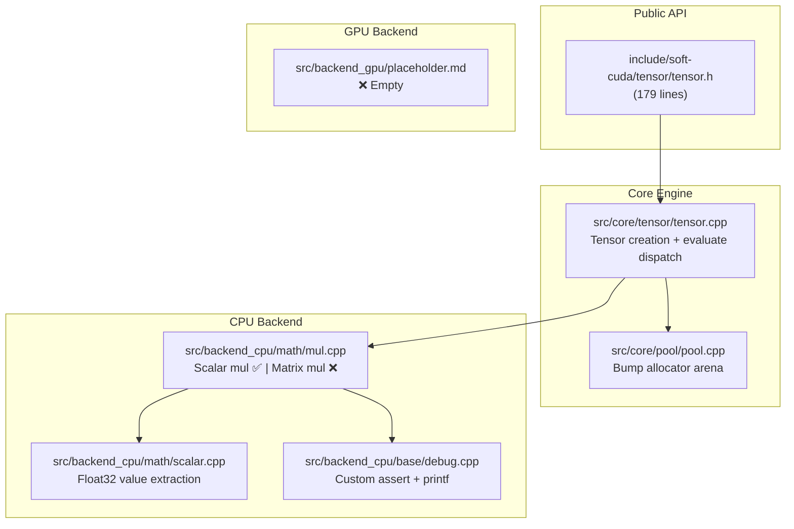

# Soft-CUDA Repository — Full Analysis

## Overview

**soft-cuda** is a C++23 library that aims to be a software-emulated tensor computation engine, inspired by CUDA's execution model. It provides a C-style API with opaque types, a bump-allocator memory pool, and a deferred (lazy) evaluation graph. The goal appears to be a PyTorch/tinygrad-like tensor library that can run on CPU and eventually dispatch to a GPU backend.

**Current state: Early prototype.** Only scalar multiplication actually executes. The vast majority of declared API functions have no implementation.

---

## Architecture Diagram



---

## What's Working ✅

| Feature | File | Status |
|---|---|---|
| Bump allocator pool | [pool.cpp](file:///d:/AntigravityProjects/soft-cuda/src/core/pool/pool.cpp) | ✅ Solid — aligned alloc, create/destroy/reset |
| Tensor creation (all dtypes) | [tensor.cpp](file:///d:/AntigravityProjects/soft-cuda/src/core/tensor/tensor.cpp) | ✅ Works for scalars and N-D tensors |
| Scalar × Tensor multiply (float32 only) | [mul.cpp](file:///d:/AntigravityProjects/soft-cuda/src/backend_cpu/math/mul.cpp) | ✅ Functional via lazy eval |
| Lazy evaluation dispatch | [tensor.cpp](file:///d:/AntigravityProjects/soft-cuda/src/core/tensor/tensor.cpp) [tensor_evaluate()](file:///d:/AntigravityProjects/soft-cuda/src/core/tensor/tensor.cpp#112-147) | ✅ Switch on `tensor_op_t` |
| Custom debug/assert system | [debug.cpp](file:///d:/AntigravityProjects/soft-cuda/src/backend_cpu/base/debug.cpp) | ✅ Working |

---

## What's Declared but NOT Implemented ❌

These functions exist in the public header but have **zero implementation anywhere in the codebase**:

| Function | Purpose | Priority |
|---|---|---|
| [tensor_matmul()](file:///d:/AntigravityProjects/soft-cuda/include/soft-cuda/tensor/tensor.h#113-121) | Matrix multiplication | 🔴 Critical |
| [tensor_add()](file:///d:/AntigravityProjects/soft-cuda/include/soft-cuda/tensor/tensor.h#131-139) | Element-wise addition | 🔴 Critical |
| [tensor_transpose()](file:///d:/AntigravityProjects/soft-cuda/include/soft-cuda/tensor/tensor.h#123-129) | Matrix transpose | 🔴 Critical |
| [tensor_scalar_mul()](file:///d:/AntigravityProjects/soft-cuda/include/soft-cuda/tensor/tensor.h#144-152) | Scalar multiply (different API from internal [tensor_mul](file:///d:/AntigravityProjects/soft-cuda/src/backend_cpu/math/mul.cpp#32-76)) | 🟡 Medium |
| [tensor_relu()](file:///d:/AntigravityProjects/soft-cuda/include/soft-cuda/tensor/tensor.h#157-158) | ReLU activation | 🟡 Medium |
| [tensor_mse_loss()](file:///d:/AntigravityProjects/soft-cuda/include/soft-cuda/tensor/tensor.h#159-162) | Mean squared error loss | 🟡 Medium |
| [tensor_cross_entropy_loss()](file:///d:/AntigravityProjects/soft-cuda/include/soft-cuda/tensor/tensor.h#166-168) | Cross-entropy with softmax | 🟡 Medium |
| [tensor_add_bias()](file:///d:/AntigravityProjects/soft-cuda/include/soft-cuda/tensor/tensor.h#141-143) | Bias addition with broadcasting | 🟡 Medium |
| [tensor_fill_random_normal()](file:///d:/AntigravityProjects/soft-cuda/include/soft-cuda/tensor/tensor.h#163-165) | Random initialization | 🟡 Medium |
| [tensor_backward()](file:///d:/AntigravityProjects/soft-cuda/include/soft-cuda/tensor/tensor.h#174-176) | Autograd backward pass | 🔴 Critical for training |
| [tensor_sgd_template()](file:///d:/AntigravityProjects/soft-cuda/include/soft-cuda/tensor/tensor.h#177-179) | SGD optimizer | 🔴 Critical for training |
| [move_tensor_device()](file:///d:/AntigravityProjects/soft-cuda/include/soft-cuda/tensor/tensor.h#105-111) | CPU↔GPU transfer | 🟠 Future |
| [tensor_pool_reset()](file:///d:/AntigravityProjects/soft-cuda/include/soft-cuda/tensor/tensor.h#87-99) | Pool reset (declared in header, [tensor_pool_zero](file:///d:/AntigravityProjects/soft-cuda/src/core/pool/pool.cpp#37-46) exists in pool.cpp) | 🟢 Easy fix — just alias |
| [tensor_mul_op_matrix()](file:///d:/AntigravityProjects/soft-cuda/src/backend_cpu/math/mul.cpp#113-117) | Matrix multiply kernel | 🔴 Returns `false` stub |

---

## Bugs & Issues 🐛

### 1. **Critical: [tensor_mul_op_scalar](file:///d:/AntigravityProjects/soft-cuda/src/backend_cpu/math/mul.cpp#91-111) writes to wrong buffer** (in current code vs check.txt)

In [mul.cpp](file:///d:/AntigravityProjects/soft-cuda/src/backend_cpu/math/mul.cpp) (current code), the scalar multiply writes the result to `t->data` (the output tensor):
```cpp
// Current — CORRECT (writes to out)
tensor_mul_op_scalar_float32((float*)t->data, (float*)t->a->data, t->a->nvalues, tensor_float32_value(t->b));
```
But in [check.txt](file:///d:/AntigravityProjects/soft-cuda/check.txt) (older snapshot), the scalar multiply **mutates the input tensor in-place**:
```cpp
// check.txt — BUG (mutates input)
tensor_mul_op_scalar_float32((float*)t->a->data, t->a->nvalues, tensor_float32_value(t->b));
```

> [!IMPORTANT]
> The current code has been fixed, but this discrepancy between [check.txt](file:///d:/AntigravityProjects/soft-cuda/check.txt) and the actual code means **[check.txt](file:///d:/AntigravityProjects/soft-cuda/check.txt) is stale and misleading**. Either delete it or regenerate it.

### 2. **[tensor_mul_op_scalar](file:///d:/AntigravityProjects/soft-cuda/src/backend_cpu/math/mul.cpp#91-111) ignores all non-float32 dtypes**

```cpp
case tensor_dtype_t::INT32_T:
case tensor_dtype_t::UINT32_T:
case tensor_dtype_t::INT64_T:
case tensor_dtype_t::UINT64_T:
case tensor_dtype_t::FLOAT32_T:
      return tensor_mul_op_scalar_float32(...);  // ALL fall through to float32!
```

Every dtype gets cast to `float*` and processed as float32 — this will silently produce **garbage results** for int32, int64, uint32, uint64 tensors.

### 3. **Stride array is never computed**

[tensor_instance](file:///d:/AntigravityProjects/soft-cuda/src/core/include/tensor/tensor.h#11-43) has a `stride[TENSOR_MAX_DIMS]` field, but it's **never initialized** in [tensor_dtype_create()](file:///d:/AntigravityProjects/soft-cuda/src/core/include/tensor/tensor.h#44-48). There's a `// TODO: Implement the stride logic` comment. Without strides, you cannot support:
- Non-contiguous views
- Transpose (which is just a stride/shape swap)
- Broadcasting

### 4. **`num_dims` parameter in [tensor_create()](file:///d:/AntigravityProjects/soft-cuda/src/core/tensor/tensor.cpp#106-111) is ignored**

```cpp
tensor_t *tensor_create(tensor_pool_t *pool, tensor_dtype_t dtype, uint32_t num_dims, uint32_t *dims, float *elems) {
    return tensor_dtype_create(pool, dtype, dims, elems);
    // TODO: Handle num_dims to proccede with stride logic
}
```
The `num_dims` parameter is accepted but never used. The actual ndims is inferred from the zero-terminated `dims` array, making `num_dims` redundant and confusing.

### 5. **Duplicate declarations in headers**

In [tensor.h (core)](file:///d:/AntigravityProjects/soft-cuda/src/core/include/tensor/tensor.h):
```cpp
size_t tensor_dtype_sizeof(tensor_dtype_t dtype);  // line 55
size_t tensor_dtype_sizeof(tensor_dtype_t dtype);  // line 58 — DUPLICATE

tensor_t *tensor_dtype_create(...);  // line 47
tensor_t *tensor_dtype_create(...);  // line 60 — DUPLICATE

bool tensor_evaluate(...);  // line 52
bool tensor_evaluate(...);  // line 62 — DUPLICATE
```

### 6. **`tensor_graph_t` declared but never defined or used**

```cpp
typedef struct tensor_graph_instance tensor_graph_t;  // public header
```
No implementation exists anywhere. This is a dangling forward declaration.

### 7. **Missing `#include <cstdint>` in private tensor header**

The private [tensor.h](file:///d:/AntigravityProjects/soft-cuda/src/core/include/tensor/tensor.h) uses `uint8_t`, `uint32_t` etc. but relies on the public header having included `<cstdint>` first. It works due to [internal_header.h](file:///d:/AntigravityProjects/soft-cuda/src/internal_header.h) include order, but is fragile.

---

## Design Issues & Recommendations 🏗️

### 1. **No op enum entries for most declared operations**

`tensor_op_t` only has `NONE`, `CAST`, `MUL_SCALAR`, `MUL_MATRIX`. For the lazy evaluation graph to work, you need entries for **every** operation:

```cpp
enum class tensor_op_t {
    NONE,
    CAST,
    MUL_SCALAR,
    MUL_MATRIX,
    ADD,           // ← missing
    TRANSPOSE,     // ← missing
    RELU,          // ← missing
    SCALAR_MUL,    // ← missing (public API version)
    ADD_BIAS,      // ← missing
    // ... etc
};
```

### 2. **Autograd design is incomplete**

The [tensor_instance](file:///d:/AntigravityProjects/soft-cuda/src/core/include/tensor/tensor.h#11-43) struct has `grad_compute` and `grad` fields, and the public API declares [tensor_backward()](file:///d:/AntigravityProjects/soft-cuda/include/soft-cuda/tensor/tensor.h#174-176), but:
- No gradient functions are implemented for any op
- No computation graph traversal (topological sort) exists
- The `a` and `b` pointers form a tree, not a DAG — if a tensor is reused in two operations, the graph breaks
- No mechanism to mark tensors as requiring gradients (leaf vs intermediate)

**Recommendation**: Before implementing backward, redesign the computation graph:
- Use a proper DAG with topological sort
- Add `requires_grad` flag
- Implement gradient functions alongside each forward op

### 3. **Memory model limitations**

The bump allocator is great for forward-only inference, but:
- **No individual tensor deallocation** — you can only reset the entire pool
- **Training requires multiple pools** — one for weights (persistent), one for activations (reset per iteration)
- The [tensor_sgd_template](file:///d:/AntigravityProjects/soft-cuda/include/soft-cuda/tensor/tensor.h#177-179) signature takes a pool, suggesting you're aware of this, but there's no documentation of the multi-pool strategy

### 4. **API inconsistency between [tensor_mul](file:///d:/AntigravityProjects/soft-cuda/src/backend_cpu/math/mul.cpp#32-76) and other ops**

- [tensor_mul()](file:///d:/AntigravityProjects/soft-cuda/src/backend_cpu/math/mul.cpp#32-76) returns a new tensor (lazy)
- [tensor_matmul()](file:///d:/AntigravityProjects/soft-cuda/include/soft-cuda/tensor/tensor.h#113-121), [tensor_add()](file:///d:/AntigravityProjects/soft-cuda/include/soft-cuda/tensor/tensor.h#131-139), [tensor_relu()](file:///d:/AntigravityProjects/soft-cuda/include/soft-cuda/tensor/tensor.h#157-158) all take an `out` parameter (eager-style)
- [tensor_mse_loss()](file:///d:/AntigravityProjects/soft-cuda/include/soft-cuda/tensor/tensor.h#159-162), [tensor_cross_entropy_loss()](file:///d:/AntigravityProjects/soft-cuda/include/soft-cuda/tensor/tensor.h#166-168) return a new tensor (lazy-style)

**Pick one pattern.** The lazy approach (return new tensor) is better for autograd since it naturally builds the computation graph. The out-parameter approach requires the caller to pre-allocate and breaks the graph.

### 5. **No test framework**

The only "test" is [main.cpp](file:///d:/AntigravityProjects/soft-cuda/src/main.cpp) which hard-codes a single scalar multiply test. You should add:
- A proper test framework (e.g., Google Test, or even simple `assert`-based test functions)
- Tests for each implemented operation
- Shape validation tests
- Pool exhaustion tests

### 6. **CMake doesn't include GPU backend path**

```cmake
target_include_directories(soft
  PUBLIC  "${CMAKE_CURRENT_SOURCE_DIR}/include"
  PRIVATE "${CMAKE_CURRENT_SOURCE_DIR}/src/backend_cpu/include"
  PRIVATE "${CMAKE_CURRENT_SOURCE_DIR}/src/core/include"
  PRIVATE "${CMAKE_CURRENT_SOURCE_DIR}/src"
)
# No backend_gpu include path
```

---

## Summary Scorecard

| Area | Score | Notes |
|---|---|---|
| **Architecture** | 7/10 | Clean separation (public/core/backend), opaque types, good layering |
| **Memory management** | 8/10 | Bump allocator is well-implemented and appropriate |
| **API design** | 5/10 | Inconsistent patterns (return vs out-param), redundant `num_dims` |
| **Implementation completeness** | 2/10 | Only scalar multiply works, 90% is stubs |
| **Code quality** | 6/10 | Readable but has duplicate declarations, stale check.txt, missing strides |
| **Autograd readiness** | 2/10 | Fields exist but no graph traversal or gradient functions |
| **Testing** | 1/10 | Single hard-coded test in main |

---

## Recommended Next Steps (Priority Order)

1. **Implement strides** — everything downstream depends on this
2. **Implement [tensor_add](file:///d:/AntigravityProjects/soft-cuda/include/soft-cuda/tensor/tensor.h#131-139)** and **[tensor_mul_op_matrix](file:///d:/AntigravityProjects/soft-cuda/src/backend_cpu/math/mul.cpp#113-117)** (element-wise) — the foundational ops
3. **Implement [tensor_matmul](file:///d:/AntigravityProjects/soft-cuda/include/soft-cuda/tensor/tensor.h#113-121)** — needed for any neural network
4. **Fix the dtype fallthrough bug** in [tensor_mul_op_scalar](file:///d:/AntigravityProjects/soft-cuda/src/backend_cpu/math/mul.cpp#91-111)
5. **Standardize the API** to one pattern (lazy return is recommended)
6. **Add `tensor_op_t` entries** for all operations
7. **Build a proper test suite**
8. **Design the autograd graph** before implementing backward
9. **Delete or regenerate [check.txt](file:///d:/AntigravityProjects/soft-cuda/check.txt)**

---

* This documentation is generated using generative AI claude opus 4.6 on 14/03/2026 12:39 AM


